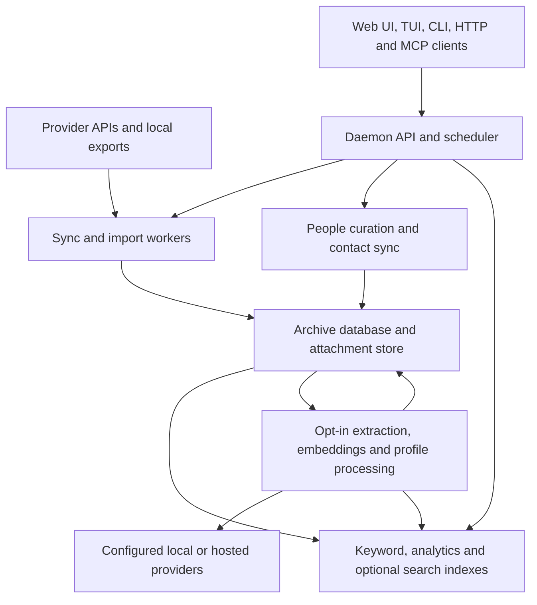

msgvault keeps communications and curated relationships in an archive you
operate. The daemon owns archive access and background work. The browser,
terminal, CLI, HTTP clients, and MCP tools use that daemon to read and maintain
the same data.

SQLite is the default database. Attachments live beside it as files or packed
blobs. Search and analytics use indexes derived from the archive. Optional
model processing adds semantic search, document extraction, and profile
inference without making a model provider the system of record.

## What works today

- Provider sync and local imports share message, conversation, participant,
  attachment, and source records.
- A people layer connects observed identifiers to durable curated profiles,
  organizations, employment, relationships, and contact activity.
- Keyword search and analytics read archived data. Optional processing uses
  separately configured embedding, extraction, inference, or enrichment services.
- The daemon serves the Web UI and versioned HTTP API, schedules work, and
  coordinates mutations. CLI, TUI, and MCP clients can use a local or remote daemon.
- SQLite archives have Parquet analytics, packed attachment storage, and
  verifiable backup repositories.

## Current boundaries

- Source APIs and export formats determine which history and media can be
  captured. An archived message does not imply that every attachment downloaded.
- PostgreSQL is opt-in for new archives. It has no built-in SQLite migration
  command and does not serve every cache-backed analytical view. See
  [PostgreSQL scope](postgresql.md#current-scope).
- Optional processing may contact external services. Consent and configuration
  are specific to each feature; ordinary keyword search needs neither.
- Profile briefs currently summarize supported chat and text inputs only.
  They do not cover email, meeting transcripts, documents, or the user's replies.

## Data flow

Sync stores source identifiers, checkpoints, and raw evidence alongside parsed
records. Attachments are addressed by their SHA-256 content hash so occurrences
can share the same stored bytes. Repeated imports and syncs use source identity
to update or skip records according to that provider's rules.

On SQLite, analytics exports message metadata to Parquet. DuckDB queries those
files for grouping and drill-down without scanning message bodies. FTS5 indexes
message text for keyword search. Semantic search stores vectors in a separate
SQLite index; PostgreSQL uses its own full-text search and optional pgvector.
See [storage](storage.md) and [search ranking](search-ranking.md).

## Responsibilities

| Component | Owns | Main source locations |
|---|---|---|
| Daemon and scheduler | Database lifecycle, request routing, mutation coordination, scheduled jobs, and operation history | `cmd/msgvault/cmd/serve*`, `internal/api`, `internal/scheduler`, `internal/operations` |
| Clients | Interaction, output formatting, and requests to the selected daemon | `web`, `internal/tui`, `internal/mcp`, `internal/daemonclient`, `cmd/msgvault/cmd` |
| Ingestion | Source authorization, provider mapping, imports, checkpoints, and retry behavior | Provider packages in `internal/`, `internal/importer`, `internal/meetingarchive` |
| Store | Archive schema, transactions, messages, provenance, profiles, and durable job state | `internal/store`, `internal/sqldialect` |
| Attachment storage | Shared bytes, streaming reads, media policies, and packed/loose layouts | `internal/attachmentstore`, `internal/attachmentpolicy`, shared pack engine |
| Search and analytics | Search parsing, query engines, caches, vector generations, and document indexes | `internal/search`, `internal/query`, `internal/vector`, `internal/documentindex` |
| People | Observed identity links, curated facts, profiles, activity, consented maintenance, and contact sync | `internal/identityindex`, `internal/personfacts`, `internal/activity`, `internal/peoplesweep`, `internal/personenrichment`, `internal/carddav` |
| Preservation and removal | Backups, duplicate handling, deletion manifests, and explicit execution | `internal/backupapp`, `internal/dedup`, `internal/deletion` |

## Rules that matter across components

### The daemon coordinates archive mutations

Archive-access CLI commands discover or start the local daemon unless a remote
is configured. `--local` selects the local daemon; it does not make the CLI open
SQLite directly. Mutating jobs wait for the daemon's writer coordination instead
of competing through independent foreground database connections. Some offline
recovery commands require the daemon to be stopped. The
[daemon guide](../guides/daemon-migration.md) owns those lifecycle rules.

### Archive records and derived indexes have different lifetimes

The database and attachment bytes preserve source content and user curation.
Parquet caches and semantic indexes are derived and can be rebuilt. A cache
failure does not erase archived messages. Index generations track which
embedding model, policy, and scope produced vectors; incompatible generations
report stale state rather than silently serving a different search mode.

During startup, the API becomes reachable before analytics maintenance finishes.
With the automatic analytics engine, eligible queries can use live SQL until
DuckDB is ready. Cache-dependent routes can return a structured `503` with
readiness information. An explicitly selected DuckDB engine waits for its
required cache. See [API readiness](../api-server.md).

### Observed evidence and curated profiles remain distinct

A participant is an address, handle, or other identity seen in source data.
A durable person is a profile the user chooses to maintain. Identity bindings
connect them; matching display names alone do not merge people. Profile facts
retain evidence and resolution history. User pins and explicit merge or split
actions have their own contracts. See [people and profiles](../usage/people.md).

### Each external operation has its own scope

Provider sync, identity discovery, CardDAV publication, remote image downloads,
remote deletion, and optional model processing can contact services. Keyword
search and ordinary archive reads operate on stored data. Profile inference,
external enrichment, document extraction, and embedding configuration have
distinct consent and scope rules; see [configuration](../configuration.md).

### Upstream deletion and local removal are separate

Staging writes a reviewable manifest for one exact source. Execution requires
explicit consent from the invoking client. It records source-deletion state
while retaining archived messages and attachment content. Local commands such
as `gc` and `delete-deduped` can remove archive data and have separate
confirmation and backup rules. See [deletion](../usage/deletion.md) and
[deduplication](../usage/deduplication.md).

## Read further

- [Storage](storage.md): database tables, attachments, and rebuildable caches.
- [Search ranking](search-ranking.md): search-mode and backend contracts.
- [PostgreSQL](postgresql.md): setup and feature boundaries.
- [Backup repository format](backup-format.md): snapshot and restore contracts.
- [Development](../development.md): build, test, and contributor workflows.

This page describes implemented behavior. Historical designs and engineering
plans are kept in the repository's `docs/internal/` directory, outside public
navigation; their task lists are not a roadmap or proof of current behavior.
